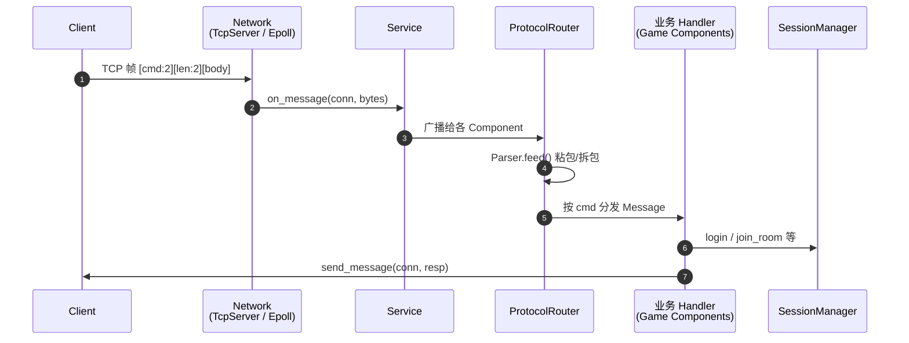
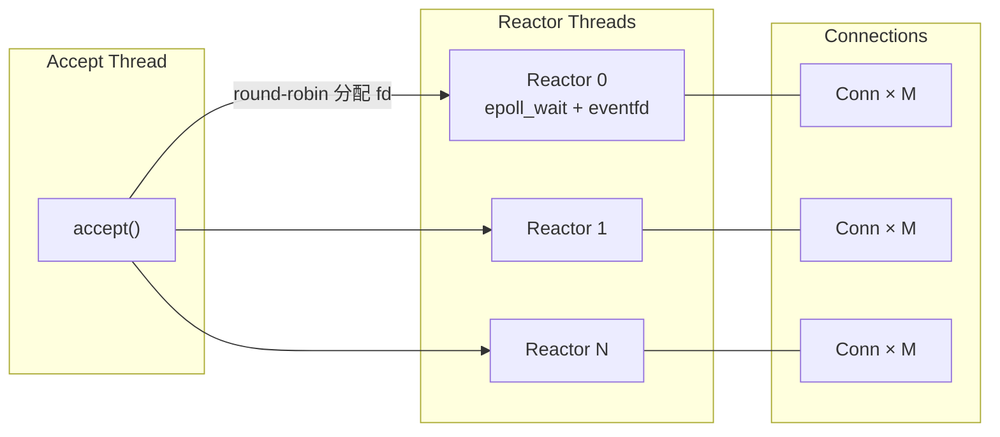
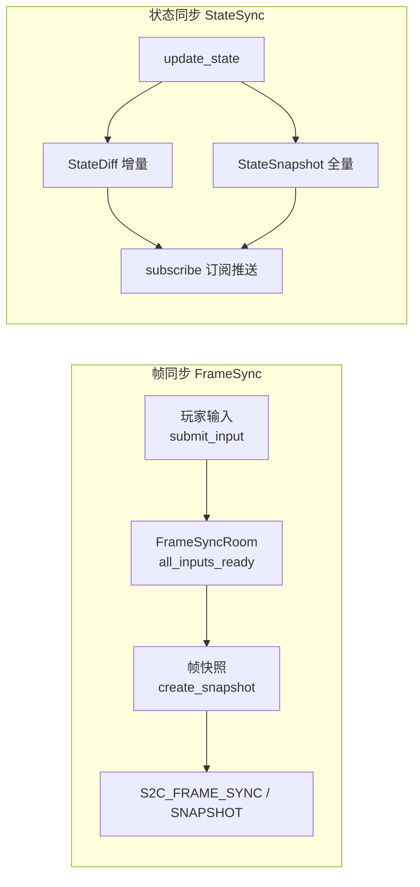

# ChwellCore — 游戏后端核心框架

模块化、高性能的 C++17 游戏服务器框架，面向 SLG / MMO 等中大型在线游戏。

[](LICENSE)
[](https://en.cppreference.com/w/cpp/17)
[](https://cmake.org/)
[](.github/workflows/ci.yml)

**English**：[README_EN.md](README_EN.md)

> **平台要求**：Linux / POSIX（依赖 `epoll`、`sys/socket.h`、`poll` 等）。Windows 上仅能做有限的语法级编译检查，完整构建与测试请在 Linux 上进行。

---

## 目录

- [特性概览](#特性概览)
- [快速开始](#快速开始)
- [架构设计](#架构设计)
- [核心模块](#核心模块)
- [代码示例](#代码示例)
- [游戏协议](#游戏协议)
- [构建选项](#构建选项)
- [测试](#测试)
- [配置文件](#配置文件)
- [目录结构](#目录结构)
- [路线图](#路线图)
- [许可证](#许可证)

---

## 特性概览

| 类别 | 功能 |
|------|------|
| **网络** | POSIX 阻塞/非阻塞 I/O；**Epoll 多 Reactor**（Accept 分离，万级并发）；TCP / UDP / WebSocket / HTTP；TLS（OpenSSL 可选）；连接池 |
| **协议** | 自定义二进制帧 `[cmd:2B][len:2B][body]`；Protobuf 帧；JSON 帧；流式粘包解析器 |
| **服务层** | 组件化 `Service` 容器（可切换 epoll / 传统模型）；按命令字路由；`SessionManager` 多维会话映射 |
| **同步** | `FrameSyncRoom`（帧同步 + 快照）；`StateSyncRoom`（K/V 状态 + 增量差异 + 订阅） |
| **游戏组件** | 登录（token 校验）、聊天、房间（一人一房）、心跳、玩家移动 |
| **基础设施** | 分层时间轮（O(1) 添加/取消）、线程池、任务队列（延时/重复/取消）、对象池、类型安全事件总线 |
| **空间** | 格子 AOI（GridAoi）、十字链表 AOI（CrossListAoi）；SLG 地图与战斗 |
| **存储** | 统一 KV 接口（Memory / MySQL / MongoDB）；模板 ORM `Repository<T>`；同步 + 异步（Future / Callback）两套 API |
| **集群** | 节点注册表（YAML + 一致性哈希）；轻量 RPC（cmd 寻址）；网关转发 |
| **可靠性** | 熔断器（计数 / 失败率 / 混合 + HALF_OPEN 探测名额）；令牌桶 / 漏桶 / 固定窗口限流；Prometheus 指标 |
| **Redis** | 自研 RESP/TCP 客户端，连接失败自动回落**内存 Mock**；分布式锁（`SET NX EX` / CAS 删除 / CAS 续租 + RAII） |
| **Benchmark** | 内置 `BenchmarkSuite`：预热 + 多次采样 + CSV/JSON 导出 |

---

## 快速开始

### 依赖（Ubuntu / Debian）

```bash
sudo apt install build-essential cmake libyaml-cpp-dev libssl-dev

# 可选存储后端
sudo apt install libmysqlclient-dev libmongoc-dev
```

### 编译

```bash
git clone <repo_url> ChwellCore
cd ChwellCore
cmake -B build -DCHWELL_BUILD_TESTS=ON -DCHWELL_BUILD_EXAMPLES=ON
cmake --build build -j"$(nproc)"
```

### 运行示例

```bash
cd build

./example_echo_server                 # Echo 服务器（端口 9000）
./epoll_echo_server                   # Epoll 多 Reactor Echo（端口 8802）
./example_protocol_server             # 协议路由服务器
./example_http_server                 # HTTP 服务器
./example_sync_demo                   # 帧同步 + 状态同步演示
./example_game_components_demo        # 游戏组件（TCP）
./example_game_ws_components_demo     # 游戏组件（WebSocket）
./example_storage && ./example_orm    # 存储 + ORM
./example_new_modules                 # 熔断 / 限流 / 发现 / 负载均衡等
```

### H5 对战小游戏 Demo

浏览器端对战 Demo（登录 → 大厅 → 房间 → 回合制对战），详见 [examples/h5_game/README.md](examples/h5_game/README.md)。

```bash
# 终端 1
./example_game_server

# 终端 2
./example_game_gateway_server

# 终端 3（需 OpenSSL）
./ws_tcp_bridge

# 终端 4：静态前端
cd ../examples/h5_game && python3 -m http.server 8080
# 浏览器打开 http://localhost:8080
```

---

## 架构设计

### 分层结构

```mermaid
flowchart TB
    subgraph APP["应用层 Application"]
        direction LR
        GC["Game Components<br/>登录 · 聊天 · 房间 · 心跳 · 移动"]
        SS["FrameSync / StateSync"]
        GW["Gateway / RPC"]
    end

    subgraph SVC["服务层 Service"]
        direction LR
        SVC1["Service 容器"]
        COMP["Component 系统"]
        SM["SessionManager"]
        PR["ProtocolRouter"]
        EB["EventBus"]
    end

    subgraph PROTO["协议层 Protocol"]
        direction LR
        PARSER["Parser 粘包解析"]
        MSG["Message cmd+body"]
        CODEC["Codec<br/>LengthHeader / Protobuf / JSON"]
    end

    subgraph NET["网络层 Network"]
        direction LR
        POSIX["posix_io<br/>socket / poll"]
        TCP["TcpServer / TcpConnection"]
        EPOLL["EpollTcpServer<br/>多 Reactor"]
        UDP["UdpSocket / UdpServer"]
        WS["WsServer"]
        HTTP["HttpServer"]
        POOL["ConnectionPool · TLS"]
    end

    subgraph INFRA["基础设施 Infrastructure"]
        direction LR
        CORE["ThreadPool · TimerWheel<br/>TaskQueue · ObjectPool"]
        STOR["Storage<br/>Memory / MySQL / MongoDB"]
        RDS["Redis · DistributedLock"]
        CLUS["ServiceDiscovery · LoadBalancer<br/>CircuitBreaker · ConsistentHash"]
        OBS["Metrics · RateLimit<br/>AOI · SlgMap"]
    end

    APP --> SVC
    SVC --> PROTO
    PROTO --> NET
    NET --> INFRA
```



### 一条消息的处理链路



### Epoll 多 Reactor 模型



> 对比：传统 `TcpServer` 为每条连接占一个阻塞读线程（并发 ≈ 线程数）；`EpollTcpServer` 用少量 Reactor 线程复用海量连接，详见[网络模型对比](#网络模型对比)。

### 组件化设计

`Service` 持有一组 `Component`，连接、消息、断线事件自动广播给每个组件：

```cpp
#include "chwell/service/service.h"

// listen_port, worker_threads, use_epoll, reactor_threads
chwell::service::Service svc(9000, 4, /*use_epoll=*/true, /*reactor_threads=*/4);

svc.add_component<chwell::service::SessionManager>();
svc.add_component<chwell::service::ProtocolRouterComponent>();
svc.add_component<chwell::game::LoginComponent>();
svc.add_component<chwell::game::ChatComponent>();
svc.add_component<chwell::game::RoomComponent>();
svc.add_component<chwell::game::HeartbeatComponent>();

svc.start();
std::cin.get();
svc.stop();
```

自定义组件继承 `Component` 并覆写所需回调：

```cpp
class MyComponent : public chwell::service::Component {
public:
    std::string name() const override { return "MyComponent"; }

    void on_message(const chwell::net::TcpConnectionPtr& conn,
                    std::string_view data) override {
        // 处理消息
    }

    void on_disconnect(const chwell::net::TcpConnectionPtr& conn) override {
        // 连接断开清理
    }
};
```

---

## 核心模块

### 网络层 (`chwell/net`)

| 类 | 说明 |
|----|------|
| `TcpServer` | 监听 + accept + 连接生命周期。**每连接占用一个线程池线程**（阻塞读循环），最大并发 ≈ 线程数，适合低并发/内部工具 |
| `TcpConnection` | TCP 连接：读写、关闭回调；`conn_id()` 进程内唯一，可作 map 键 |
| **`EpollTcpServer`** | **Epoll 多 Reactor**：Accept 独立线程 + N 个 Reactor 线程，支持万级并发 |
| **`EpollDemuxer`** | 单线程 epoll 事件循环，eventfd 唤醒，ET/LT 双模式 |
| **`EpollTcpConnection`** | 基于 Demuxer 的异步连接（读写队列、空闲超时、缓冲上限） |
| **`EpollTcpBridge`** | 将 `EpollTcpConnection` 适配为 `TcpConnectionPtr`，供 Service 组件复用 |
| `UdpSocket` / `UdpServer` | UDP 收发封装 |
| `WsServer` / `WsRawConnection` | WebSocket RFC6455 握手与文本/二进制帧（`WsConnectionPtr` 为共享指针别名） |
| `HttpServer` | 简易 HTTP 请求/响应（支持完整 body） |
| `ConnectionPool` | TCP 连接池（借出/归还、等待超时） |
| `TlsContext` / `TlsConnection` | OpenSSL 封装（`CHWELL_USE_OPENSSL=ON`） |
| `IConnection` | TCP / WebSocket 统一接口（`connection_adapter.h`：`send / send_text / close / type`） |

### 服务层 (`chwell/service`)

| 类 | 说明 |
|----|------|
| `Service` | 组件容器；持有线程池 / IoService /（可选）Epoll 服务器 |
| `Component` | 组件基类：`on_register / on_message / on_disconnect` |
| `ProtocolRouterComponent` | 按 `cmd` 路由到 `MessageHandler`；`send_message` 为静态工具 |
| `SessionManager` | 连接 → 玩家 ID / 房间 ID / 网关 ID 映射；一人一房语义 |

### 游戏组件 (`chwell/game`)

| 组件 | 说明 |
|------|------|
| `LoginComponent` | 登录/登出。**必须 `set_token_validator`**：未配置校验器时直接拒绝登录（防任意非空 token 冒充玩家） |
| `ChatComponent` | 同房间聊天广播 |
| `RoomComponent` | 房间加入/离开；**一人一房**（加入新房间会离开旧房间） |
| `HeartbeatComponent` | 心跳保活 |
| `PlayerMoveComponent` | 位置同步 + AOI 广播 |

### 同步系统 (`chwell/sync`)

- ### 同步数据流




**帧同步 `FrameSyncRoom`**：`submit_input` / `get_all_inputs` / `create_snapshot` / `get_snapshot` / `all_inputs_ready`；`FrameSyncComponent` 与 Service 集成。
- **状态同步 `StateSyncRoom`**：int32 / int64 / float / double / string / binary 六种值类型；`update_state` / `query_state` / `create_snapshot` / `subscribe`；增量 `StateDiff` + 全量 `StateSnapshot`。

### 编解码 (`chwell/codec`)

| 编解码器 | 帧格式 | 适用场景 |
|----------|--------|----------|
| 内置协议（`protocol/`） | `[cmd:2B BE][len:2B BE][body]` | 游戏服默认 |
| `LengthHeaderCodec` | 长度前缀 | 通用二进制 |
| `ProtobufCodec` | `[varint32 len][pb payload]` | 纯 Protobuf |
| `JsonCodec` | `[len:4B BE][json]` | 调试 / HTTP 风格 |

### 基础设施

| 模块 | 关键类 | 说明 |
|------|--------|------|
| `chwell/core` | `TimerWheel` | 分层时间轮：添加 / 取消均为 O(1)（`list_iter` + `in_wheel`），支持一次性 / 重复 |
| `chwell/core` | `ThreadPool` | 固定线程池，`post()` 提交 |
| `chwell/core` | `Config` | key=value 配置 + 多文件覆盖 + 环境变量 |
| `chwell/task` | `TaskQueue` / `DelayedTaskQueue` | 优先级队列；延时 / 重复 / 取消 |
| `chwell/pool` | `ObjectPool<T>` | 模板对象池 |
| `chwell/event` | `EventBus` | 类型安全发布/订阅，线程安全，支持优先级 |

### 存储层 (`chwell/storage`)

同步接口：

```cpp
#include "chwell/storage/storage_factory.h"

auto store = storage::StorageFactory::create_from_yaml("config/storage.yaml");
store->put("player:123", data);                    // put(key, value, expire_at=0)
auto r = store->get("player:123");                 // r.ok, r.value
store->remove("player:123");
bool has = store->exists("player:123");
auto keys = store->keys("player:");

// ORM 仓储
storage::orm::Repository<Player> repo(store.get(), "players");
repo.save(player);
auto p = repo.find("player123");                   // std::unique_ptr<Player>
```

异步接口（`AsyncStorageAdapter`）：

```cpp
#include "chwell/storage/async_storage_adapter.h"

storage::MemoryStorage mem;
storage::AsyncStorageAdapter async_store(&mem, /*num_threads=*/4);

auto f = async_store.async_put("key", "value");
f.get();

auto f_get = async_store.async_get("key");
auto result = f_get.get();

async_store.async_get("key", [](storage::StorageResult r) {
    if (r.ok) { /* r.value */ }
});
```

### 集群与 RPC (`chwell/cluster`, `chwell/rpc`)

RPC 以 **uint16 命令字** 寻址，body 前 4 字节为 request_id（大端），服务端原样回传：

```cpp
#include "chwell/rpc/rpc_server.h"
#include "chwell/rpc/rpc_client.h"

// 服务端
net::IoService server_io;
rpc::RpcServer server(server_io, 9090);
server.register_method(100, [](const std::vector<char>& req, std::vector<char>& resp) {
    resp = req;   // echo
});
server.start();
std::thread t([&](){ server_io.run(); });

// 客户端
net::IoService client_io;
rpc::RpcClient client(client_io, /*default_timeout_seconds=*/5);
client.connect("127.0.0.1", 9090);

std::vector<char> req = {'h','i'};
std::vector<char> resp;
bool ok = client.call_sync(100, req, resp, /*timeout_seconds=*/1);

// 异步
client.call(100, req, [](bool ok, const protocol::Message& msg) {
    // ok=false 表示超时或断开
}, /*timeout_seconds=*/1);
```

### 可靠性 (`chwell/circuitbreaker`, `chwell/ratelimit`, `chwell/metrics`)

```cpp
// 熔断器
circuitbreaker::CircuitBreakerConfig cfg;
cfg.trip_strategy = circuitbreaker::TripStrategy::FAILURE_COUNT;
cfg.failure_threshold = 5;
cfg.half_open_calls = 3;          // HALF_OPEN 探测名额
cfg.timeout_ms = 60000;
circuitbreaker::DefaultCircuitBreaker cb("svc", cfg);
auto result = cb.execute([&]() { remote_call(); });

int out = 0;
auto r = cb.execute_with_result<int>([&]() { return remote_call_int(); }, out);

// 限流器（令牌桶：capacity 为桶容量，refill_rate_per_second 为补充速率）
ratelimit::TokenBucketRateLimiter limiter(1000, 100.0);
if (limiter.consume("user_1", 1)) {
    // 放行
}
auto rem = limiter.get_remaining("user_1");

// Prometheus 指标
auto& registry = metrics::get_prometheus_registry();
auto& counter = registry.register_counter("requests_total", "total requests");
counter.inc();
std::string text = registry.export_metrics();
```

### Redis 与分布式锁 (`chwell/redis`)

`RedisClient` 自带 RESP/TCP 实现；连接失败（或 `CHWELL_REDIS_MOCK=1`）时自动使用**内存 Mock**，`is_mock()` 可查询当前模式。

```cpp
#include "chwell/redis/redis_client.h"
#include "chwell/redis/distributed_lock.h"

redis::RedisConfig cfg;                 // host / port / password
redis::RedisClient::Ptr redis = std::make_shared<redis::RedisClient>(cfg);
redis->connect();

redis->set("key", "value");
auto val = redis->get("key");

// RAII 分布式锁：构造时 SET NX EX 加锁，自动续租，析构 compare_and_del 解锁
{
    redis::DistributedLockGuard guard(redis, "resource:123", /*ttl_seconds=*/30);
    if (guard.acquired()) {
        // 临界区；可取 guard.fencing_token()
    }
}
```

> **多实例部署**：内存 Mock 仅保证单进程语义正确；跨进程锁依赖真实 Redis（RESP 路径）。fencing token 目前为进程内序号，跨进程需服务端 `INCR`。

### Benchmark (`chwell/benchmark`)

```cpp
chwell::benchmark::BenchmarkSuite suite("MyBench");
suite.add_benchmark("vector_push", "push_back 10000 int", []() {
    std::vector<int> v;
    for (int i = 0; i < 10000; ++i) v.push_back(i);
});

chwell::benchmark::BenchmarkConfig cfg;
cfg.warmup_iterations = 100;
cfg.measurement_iterations = 1000;
auto results = suite.run(cfg);
std::string csv = suite.export_csv();   // 或 export_json()
```

---

## 代码示例

### Echo 服务器

```cpp
#include "chwell/service/service.h"
#include "chwell/service/component.h"

class EchoComponent : public chwell::service::Component {
public:
    std::string name() const override { return "EchoComponent"; }

    void on_message(const chwell::net::TcpConnectionPtr& conn,
                    std::string_view data) override {
        conn->send(data);
    }
};

int main() {
    chwell::service::Service svc(9000, 2);
    svc.add_component<EchoComponent>();
    svc.start();
    std::cin.get();
    return 0;
}
```

### 协议路由服务器

```cpp
#include "chwell/service/service.h"
#include "chwell/service/session_manager.h"
#include "chwell/service/protocol_router.h"

int main() {
    chwell::service::Service svc(9000, 4);

    auto* router = svc.add_component<chwell::service::ProtocolRouterComponent>();
    svc.add_component<chwell::service::SessionManager>();

    router->register_handler(0x0001,
        [](const chwell::net::TcpConnectionPtr& conn,
           const chwell::protocol::Message& msg) {
            chwell::protocol::Message resp(0x0002, "login ok");
            chwell::service::ProtocolRouterComponent::send_message(conn, resp);
        });

    svc.start();
    std::cin.get();
    return 0;
}
```

### 时间轮定时器

```cpp
#include "chwell/core/timer_wheel.h"

chwell::core::TimerWheel wheel(/*tick_ms=*/100, /*wheel_size=*/60, /*layers=*/4);
wheel.start();

auto h = wheel.add_timer(500, []() { /* 一次性 */ });
auto r = wheel.add_repeat_timer(1000, []() { /* 周期 */ });

wheel.cancel_timer(r);   // O(1) 取消
wheel.stop();
```

### AOI

```cpp
#include "chwell/aoi/aoi.h"

chwell::aoi::GridAoi aoi;
chwell::aoi::Entity e(/*id=*/1, /*x=*/100, /*y=*/100, chwell::aoi::EntityType::PLAYER);
aoi.add_entity(e);
aoi.set_callback([](const chwell::aoi::AoiEvent& ev) {
    // ENTER / LEAVE / MOVE；回调在锁外派发，可安全重入 AOI API
});
auto visible = aoi.get_entities_in_view(1);
```

---

## 游戏协议

### 帧格式

```
+----------+----------+---------------------------+
|  cmd     |  len     |  body                     |
|  2 字节  |  2 字节  |  len 字节                 |
|  大端序  |  大端序  |  业务数据                 |
+----------+----------+---------------------------+
```

> `len` 最大 65535；超长 body 会被序列化拒绝。

### 命令字一览

**游戏组件（`game_components.h` / `player_move.h`）**

| 命令字 | 名称 | 方向 |
|--------|------|------|
| 0x0001 | C2S_LOGIN | C→S |
| 0x0002 | S2C_LOGIN | S→C |
| 0x0003 | C2S_CHAT | C→S |
| 0x0004 | S2C_CHAT | S→C |
| 0x0005 | C2S_HEARTBEAT | C→S |
| 0x0006 | S2C_HEARTBEAT | S→C |
| 0x0007 | C2S_JOIN_ROOM | C→S |
| 0x0008 | S2C_JOIN_ROOM | S→C |
| 0x0081 | C2S_PLAYER_MOVE | C→S |
| 0x0082 | S2C_PLAYER_MOVE | S→C |
| 0x0083 | S2C_PLAYER_POS | S→C |
| 0x00FF | S2C_ERROR | S→C |

**帧同步（`frame_sync.h`，0x01xx）**

| 命令字 | 名称 |
|--------|------|
| 0x0101 | C2S_FRAME_INPUT |
| 0x0102 | C2S_FRAME_SYNC_REQ |
| 0x0103 | S2C_FRAME_SYNC |
| 0x0104 | S2C_FRAME_STATE |
| 0x0105 | S2C_FRAME_SNAPSHOT |
| 0x01FF | S2C_FRAME_ERROR |

**状态同步（`state_sync.h`，0x02xx）**

| 命令字 | 名称 |
|--------|------|
| 0x0201 | C2S_STATE_UPDATE |
| 0x0202 | C2S_STATE_QUERY |
| 0x0203 | C2S_STATE_SUBSCRIBE |
| 0x0204 | C2S_STATE_UNSUBSCRIBE |
| 0x0205 | S2C_STATE_UPDATE |
| 0x0206 | S2C_STATE_DIFF |
| 0x0207 | S2C_STATE_SNAPSHOT |
| 0x02FF | S2C_STATE_ERROR |

---

## 构建选项

| CMake 选项 | 默认值 | 说明 |
|------------|--------|------|
| `CHWELL_BUILD_EXAMPLES` | `ON` | 编译示例程序 |
| `CHWELL_BUILD_TESTS` | `ON` | 编译单元测试（GoogleTest 未安装时自动 FetchContent） |
| `CHWELL_USE_YAML` | `ON` | yaml-cpp（存储/集群配置） |
| `CHWELL_USE_PROTOBUF` | `ON` | Protobuf 帧编解码示例 |
| `CHWELL_USE_MYSQL` | `OFF` | MySQL 存储后端 |
| `CHWELL_USE_MONGODB` | `OFF` | MongoDB 存储后端 |
| `CHWELL_USE_OPENSSL` | `OFF` | TLS / WebSocket SHA-1 握手 |

**最小化构建：**

```bash
cmake -B build \
  -DCHWELL_BUILD_TESTS=OFF \
  -DCHWELL_USE_YAML=OFF \
  -DCHWELL_USE_PROTOBUF=OFF
cmake --build build -j"$(nproc)"
```

---

## 测试

```bash
cd build

# 全部测试
ctest --output-on-failure
# 或直接
./chwell_core_tests
./chwell_integration_tests

# 过滤
./chwell_core_tests --gtest_filter="RateLimitTest.*"
./chwell_core_tests --gtest_filter="TimerWheelTest.*"
```

CI（GitHub Actions）在 Linux 上跑三套检查：`build-and-test`、`asan`、`tsan`。

### 测试覆盖

| 测试文件 | 覆盖模块 |
|----------|----------|
| `test_protocol_parser.cpp` | 协议序列化 / 粘包解析 |
| `test_protocol_router.cpp` | 命令字路由 |
| `test_session_manager.cpp` | 会话（登录/登出/房间） |
| `test_timer_wheel.cpp` | 时间轮（添加/重复/取消/多定时器） |
| `test_aoi.cpp` | GridAoi / CrossListAoi（含回调重入） |
| `test_event_bus.cpp` | 事件总线 |
| `test_object_pool.cpp` | 对象池 |
| `test_task_queue.cpp` | TaskQueue / DelayedTaskQueue |
| `test_sync.cpp` | 帧同步 / 状态同步 |
| `test_discovery_loadbalance.cpp` | 服务发现 / 负载均衡（按 service_id 隔离） |
| `test_consistent_hash.cpp` | 一致性哈希（含重注册去重） |
| `test_circuitbreaker.cpp` | 熔断器（计数/失败率/混合/HALF_OPEN 名额） |
| `test_ratelimit.cpp` | 令牌桶 / 漏桶 / 固定窗口 |
| `test_prometheus_metrics.cpp` | 指标注册与导出 |
| `test_benchmark.cpp` | Benchmark 框架 |
| `test_rpc.cpp` | RPC 并发 / 超时 / 熔断 |
| `test_slg.cpp` | SLG 地图 / 战斗 |
| `test_game_components.cpp` | 游戏组件编解码 |
| `test_player_move.cpp` | 玩家移动 |
| `test_udp_socket.cpp` | UDP |
| `test_orm_repository.cpp` | ORM CRUD |
| `test_storage.cpp` | Document / MemoryStorage TTL / 批量 / Factory / AsyncStorageAdapter |
| `test_redis_client.cpp` | Redis Mock + RESP 语义 + 惰性过期 + 分布式锁 |
| `test_gateway_multinode.cpp` | 多节点注册 / 发现 / 分布式锁 |

---

## 配置文件

### `config/storage.yaml`

```yaml
storage:
  type: memory       # memory | mysql | mongodb
  mysql:
    host: 127.0.0.1
    port: 3306
    database: chwell
    user: root
    password: ""
  mongodb:
    uri: mongodb://127.0.0.1:27017
    database: chwell
```

### `config/cluster.yaml`

```yaml
nodes:
  - id: game_server_1
    type: game
    host: 127.0.0.1
    port: 9000
  - id: game_server_2
    type: game
    host: 127.0.0.1
    port: 9001
```

### `config/server.conf`

```ini
listen_port = 9000
worker_threads = 4
log_level = "INFO"
log_path = "./logs/"
```

---

## 目录结构

```
ChwellCore/
├── include/chwell/               # 对外头文件
│   ├── core/                     # config · endian · logger · thread_pool · timer_wheel
│   ├── net/                      # posix_io · tcp_*/epoll_* · udp_* · ws_* · http · tls · pool
│   ├── protocol/                 # message · parser
│   ├── codec/                    # LengthHeader / Protobuf / Json
│   ├── service/                  # Service · Component · ProtocolRouter · SessionManager
│   ├── game/                     # game_components · player_move
│   ├── sync/                     # frame_sync · state_sync
│   ├── task/                     # task_queue
│   ├── pool/                     # object_pool
│   ├── event/                    # event_bus
│   ├── aoi/                      # aoi (GridAoi · CrossListAoi)
│   ├── slg/                      # map · battle
│   ├── storage/                  # 接口 · 工厂 · Memory/MySQL/Mongo · ORM
│   ├── cluster/                  # node · node_registry
│   ├── rpc/                      # rpc_client · rpc_server
│   ├── gateway/                  # gateway_forwarder
│   ├── redis/                    # redis_client · distributed_lock
│   ├── discovery/                # service_discovery
│   ├── loadbalance/              # load_balancer · consistent_hash
│   ├── circuitbreaker/           # circuit_breaker
│   ├── ratelimit/                # rate_limiter
│   ├── metrics/                  # prometheus_metrics
│   └── benchmark/                # benchmark
├── src/                          # 与 include/ 镜像的实现
├── tests/                        # GoogleTest 单元测试
├── integration_tests/            # 集成测试
├── examples/                     # 示例程序 + h5_game/ 前端
├── proto/game.proto
├── config/                       # cluster.yaml · server.conf · storage.yaml
├── .github/workflows/ci.yml      # build-and-test / asan / tsan
├── CMakeLists.txt
└── README.md
```

### 主要示例目标

| 目标 | 说明 |
|------|------|
| `example_echo_server` | TCP Echo |
| `epoll_echo_server` / `epoll_stress_test` | Epoll Echo 与压测 |
| `example_protocol_server` / `example_protocol_stress_client` | 协议路由 |
| `example_http_server` | HTTP |
| `example_game_server` / `example_game_gateway_server` | H5 Demo 后端 |
| `example_game_components_demo` / `example_game_ws_components_demo` | 游戏组件 |
| `example_sync_demo` | 同步演示 |
| `example_storage` / `example_orm` | 存储 / ORM |
| `example_new_modules` | 熔断 / 限流 / 发现 / 负载均衡 |
| `example_proto_frame_server` / `example_proto_frame_client` | Protobuf 帧 |
| `example_json_frame_client` | JSON 帧 |
| `ws_tcp_bridge` | WebSocket ↔ TCP 桥（需 OpenSSL） |
| `bench_runner` | Benchmark 入口 |

---

## 网络模型对比

```
TcpServer（传统）                EpollTcpServer（高性能）
┌────────────────┐              ┌─────────────────────────┐
│  Accept Thread │              │  Accept Thread（独立）   │
├────────────────┤              ├─────────────────────────┤
│ Worker1 → Conn1│              │ Reactor0 → N 个 Conn     │
│ Worker2 → Conn2│              │ Reactor1 → N 个 Conn     │
│ Worker3 → Conn3│              │ Reactor2 → N 个 Conn     │
│ …              │              │ …                       │
│ 并发 ≈ 线程数  │              │ 万级并发（受 fd 限制）    │
└────────────────┘              └─────────────────────────┘
```

| 指标 | TcpServer | EpollTcpServer |
|------|-----------|----------------|
| I/O 模型 | 每连接一线程阻塞读 | 非阻塞 epoll 多路复用 |
| 最大连接 | ≈ worker 线程数 | 受 fd / 内存限制 |
| 适用场景 | 内部工具、低并发 | 生产级高并发 |
| Service 切换 | `use_epoll=false` | `use_epoll=true` |

### Epoll Echo 压测（参考值）

> 环境相关，仅供量级参考。工具：`epoll_stress_test <concurrency> <msg_size> <duration_s>`。

| 并发 | 消息 | Send QPS | Recv QPS | 带宽 | 平均延迟 |
|------|------|----------|----------|------|----------|
| 100 | 1KB | 347,648 | 103,550 | 339 MB/s | ~1 ms |
| 1,000 | 1KB | 740,286 | 94,471 | 684 MB/s | ~11 ms |
| 5,000 | 1KB | 148,391 | 148,169 | 145 MB/s | ~34 ms |
| 10,000 | 1KB | 125,802 | 109,313 | 122 MB/s | ~92 ms |

---

## 路线图

### 已完成

- 网络层：TCP / UDP / WebSocket / HTTP / TLS，Epoll 多 Reactor
- 二进制协议 + 粘包解析 + 三种 Codec
- 组件化服务层（登录 / 聊天 / 房间 / 心跳 / 移动）
- 帧同步 / 状态同步
- 时间轮 / 线程池 / 对象池 / 任务队列 / 事件总线
- 存储抽象（Memory / MySQL / MongoDB）+ ORM + 异步适配器
- 集群节点注册 + 一致性哈希 + RPC + 网关转发
- 服务发现 + 负载均衡（按 service_id 隔离缓存）
- 熔断器（含 HALF_OPEN 探测名额）+ 限流器（三种策略）+ Prometheus 指标
- Redis RESP 客户端（Mock 回落）+ 分布式锁（SET NX EX / CAS）
- AOI（回调锁外派发）+ SLG 地图 / 战斗
- Benchmark 框架
- H5 对战 Demo（前后端）
- CI：build-and-test + ASan + TSan 全绿

### 规划中

- 结构化日志（spdlog 选项）
- 更多游戏组件（好友、公会、排行榜）
- 热更新
- 更多集成测试场景

---

## 许可证

本项目采用 MIT 许可证，详见 [LICENSE](LICENSE)。
