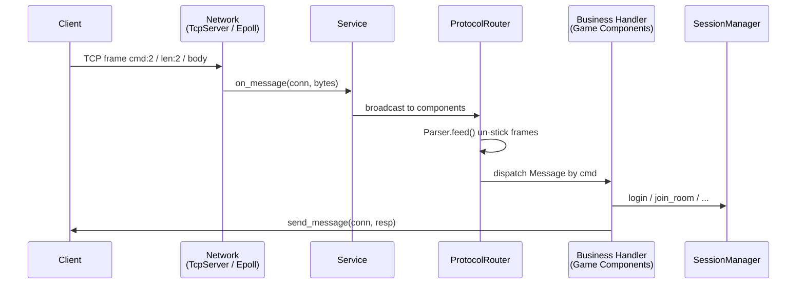
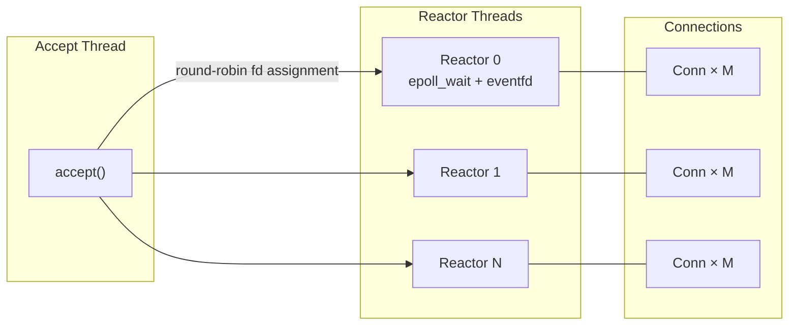
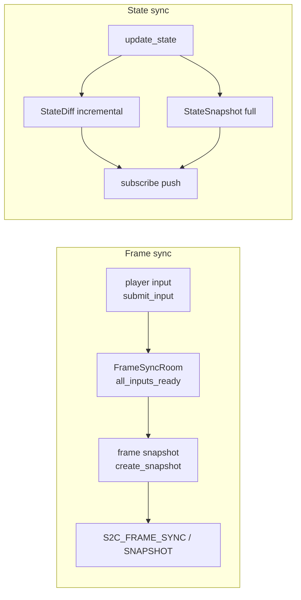
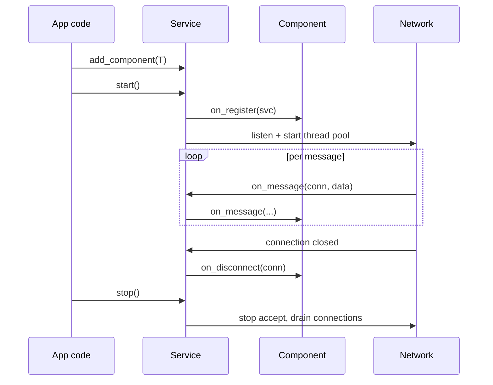
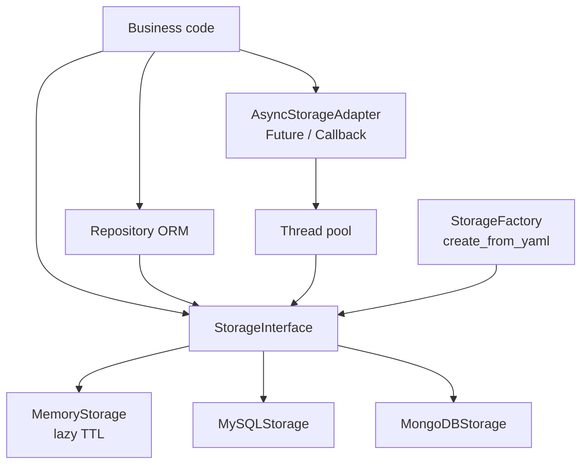
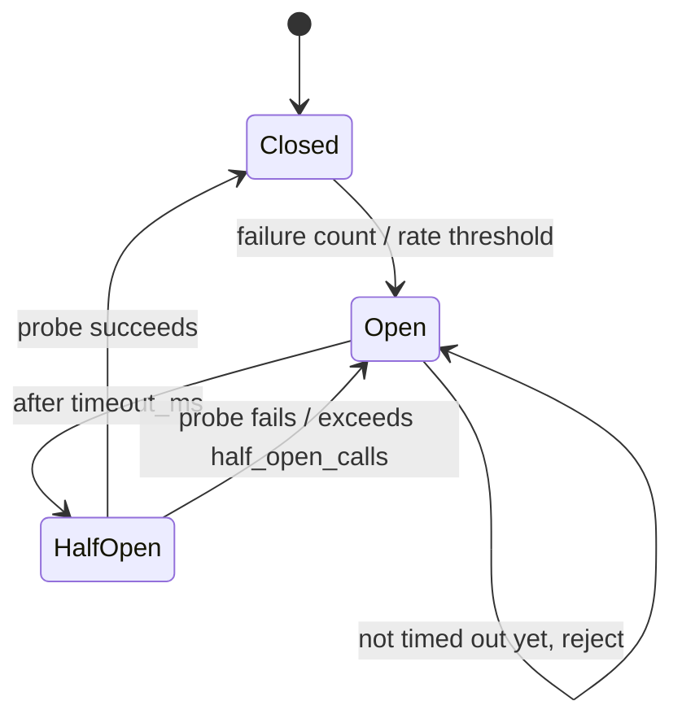
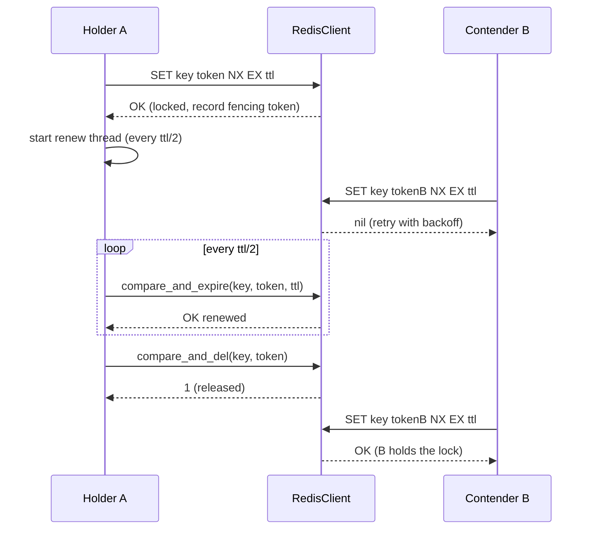
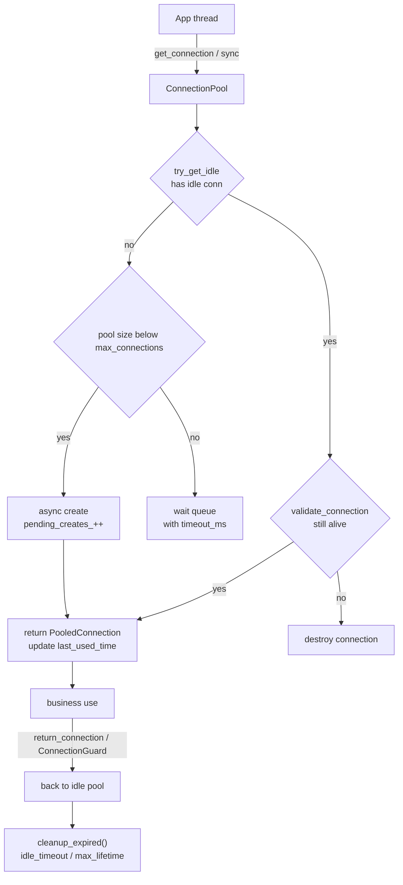
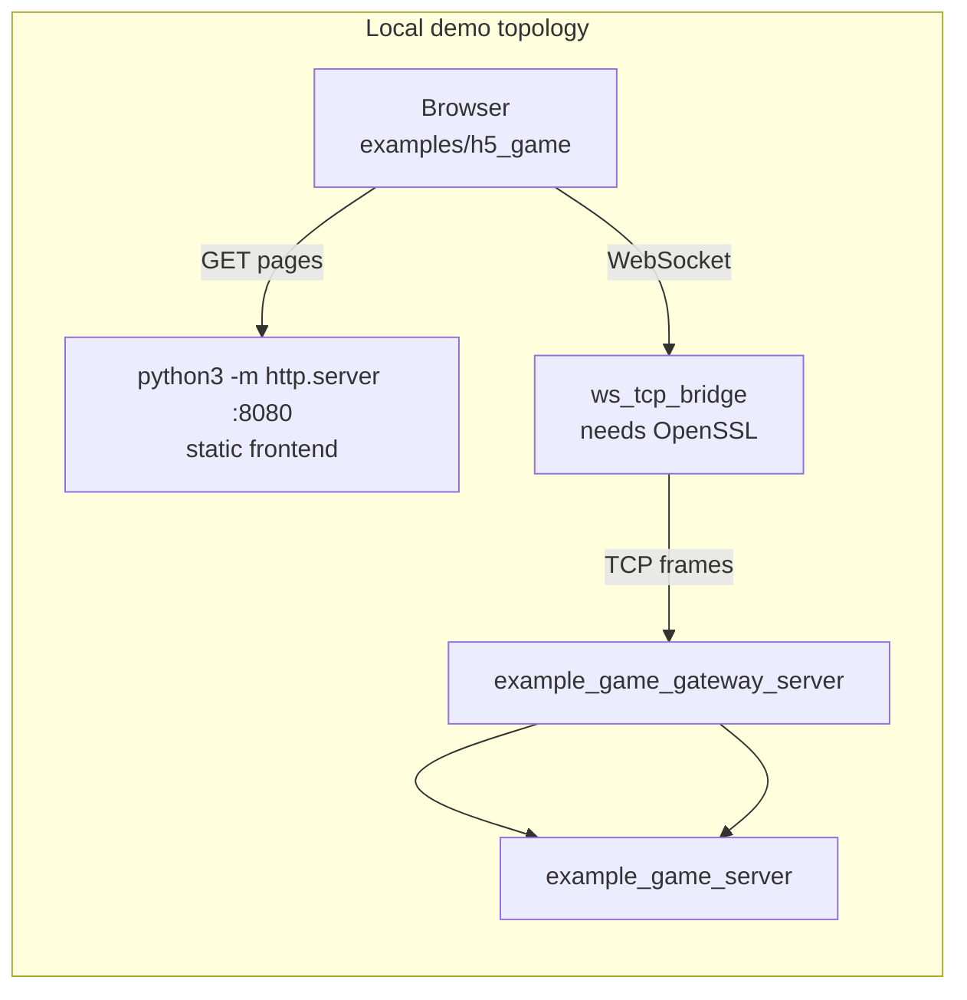

# ChwellCore — Game Backend Framework

Modular, high-performance C++17 game server framework for SLG / MMO titles.

[](LICENSE)
[](https://en.cppreference.com/w/cpp/17)
[](https://cmake.org/)
[](.github/workflows/ci.yml)

> **Platform**: Linux / POSIX only (`epoll`, `sys/socket.h`, `poll`, …). On Windows you can do limited syntax-level checks; build and test on Linux.

**中文文档**：[README.md](README.md)

---

## Contents

- [Feature Overview](#feature-overview)
- [Quick Start](#quick-start)
- [Architecture](#architecture)
- [Core Modules](#core-modules)
- [Code Examples](#code-examples)
- [Game Protocol](#game-protocol)
- [Build Options](#build-options)
- [Testing](#testing)
- [Configuration](#configuration)
- [Project Layout](#project-layout)
- [Roadmap](#roadmap)
- [License](#license)

---

## Feature Overview

| Area | Features |
|------|----------|
| **Network** | POSIX blocking/non-blocking I/O; **Epoll multi-Reactor** (dedicated accept thread, 10k+ connections); TCP / UDP / WebSocket / HTTP; TLS (optional OpenSSL); connection pool |
| **Protocol** | Custom binary frame `[cmd:2B][len:2B][body]`; Protobuf frame; JSON frame; streaming sticky-packet parser |
| **Service layer** | Component-based `Service` container (epoll / legacy switch); command routing; `SessionManager` multi-key session map |
| **Sync** | `FrameSyncRoom` (frame sync + snapshots); `StateSyncRoom` (K/V state + diff + subscribe) |
| **Game components** | Login (token validation), chat, room (one room per connection), heartbeat, player move |
| **Infrastructure** | Hierarchical timer wheel (O(1) add/cancel), thread pool, task queue (delay / repeat / cancel), object pool, type-safe event bus |
| **Spatial** | Grid AOI (`GridAoi`), cross-list AOI (`CrossListAoi`); SLG map & battle |
| **Storage** | Unified KV interface (Memory / MySQL / MongoDB); templated ORM `Repository<T>`; sync + async (Future / Callback) APIs |
| **Cluster** | Node registry (YAML + consistent hash); lightweight RPC (cmd-addressed); gateway forwarding |
| **Reliability** | Circuit breaker (count / failure-rate / hybrid + HALF_OPEN probe budget); token bucket / leaky bucket / fixed window rate limiters; Prometheus metrics |
| **Redis** | Hand-rolled RESP/TCP client with in-memory **mock fallback**; distributed lock (`SET NX EX` / CAS delete / CAS renew + RAII) |
| **Benchmark** | Built-in `BenchmarkSuite`: warmup + multi-sample runs + CSV/JSON export |

---

## Quick Start

### Dependencies (Ubuntu / Debian)

```bash
sudo apt install build-essential cmake libyaml-cpp-dev libssl-dev

# Optional storage backends
sudo apt install libmysqlclient-dev libmongoc-dev
```

### Build

```bash
git clone <repo_url> ChwellCore
cd ChwellCore
cmake -B build -DCHWELL_BUILD_TESTS=ON -DCHWELL_BUILD_EXAMPLES=ON
cmake --build build -j"$(nproc)"
```

### Run examples

```bash
cd build

./example_echo_server                 # Echo server (port 9000)
./epoll_echo_server                   # Epoll multi-Reactor echo (port 8802)
./example_protocol_server             # Protocol router server
./example_http_server                 # HTTP server
./example_sync_demo                   # Frame + state sync demo
./example_game_components_demo        # Game components (TCP)
./example_game_ws_components_demo     # Game components (WebSocket)
./example_storage && ./example_orm    # Storage + ORM
./example_new_modules                 # Circuit breaker / rate limit / discovery / LB
```

### H5 browser battle demo

Browser demo (login → lobby → room → turn-based battle). See [examples/h5_game/README.md](examples/h5_game/README.md).

```bash
# Terminal 1
./example_game_server

# Terminal 2
./example_game_gateway_server

# Terminal 3 (requires OpenSSL)
./ws_tcp_bridge

# Terminal 4: static frontend
cd ../examples/h5_game && python3 -m http.server 8080
# Open http://localhost:8080
```

---

## Architecture

### Layered structure

```mermaid
flowchart TB
    subgraph APP["Application Layer"]
        direction LR
        GC["Game Components<br/>login · chat · room · heartbeat · move"]
        SS["FrameSync / StateSync"]
        GW["Gateway / RPC"]
    end

    subgraph SVC["Service Layer"]
        direction LR
        SVC1["Service container"]
        COMP["Component system"]
        SM["SessionManager"]
        PR["ProtocolRouter"]
        EB["EventBus"]
    end

    subgraph PROTO["Protocol Layer"]
        direction LR
        PARSER["Parser (sticky packets)"]
        MSG["Message cmd+body"]
        CODEC["Codec<br/>LengthHeader / Protobuf / JSON"]
    end

    subgraph NET["Network Layer"]
        direction LR
        POSIX["posix_io<br/>socket / poll"]
        TCP["TcpServer / TcpConnection"]
        EPOLL["EpollTcpServer<br/>multi-Reactor"]
        UDP["UdpSocket / UdpServer"]
        WS["WsServer"]
        HTTP["HttpServer"]
        POOL["ConnectionPool · TLS"]
    end

    subgraph INFRA["Infrastructure"]
        direction LR
        CORE["ThreadPool · TimerWheel<br/>TaskQueue · ObjectPool"]
        STOR["Storage<br/>Memory / MySQL / MongoDB"]
        RDS["Redis · DistributedLock"]
        CLUS["ServiceDiscovery · LoadBalancer<br/>CircuitBreaker · ConsistentHash"]
        OBS["Metrics · RateLimit<br/>AOI · SlgMap"]
    end

    APP --> SVC
    SVC --> PROTO
    PROTO --> NET
    NET --> INFRA
```



### Message path



### Epoll multi-Reactor



> Contrast: legacy `TcpServer` pins one blocking read thread per connection (concurrency ≈ thread count); `EpollTcpServer` multiplexes many connections over a few reactor threads. See [Network Model Comparison](#network-model-comparison).

### Component model

`Service` owns a set of `Component`s. Connection, message, and disconnect events are broadcast to every component:

```cpp
#include "chwell/service/service.h"

// listen_port, worker_threads, use_epoll, reactor_threads
chwell::service::Service svc(9000, 4, /*use_epoll=*/true, /*reactor_threads=*/4);

svc.add_component<chwell::service::SessionManager>();
svc.add_component<chwell::service::ProtocolRouterComponent>();
svc.add_component<chwell::game::LoginComponent>();
svc.add_component<chwell::game::ChatComponent>();
svc.add_component<chwell::game::RoomComponent>();
svc.add_component<chwell::game::HeartbeatComponent>();

svc.start();
std::cin.get();
svc.stop();
```

Custom component — inherit `Component` and override what you need:

```cpp
class MyComponent : public chwell::service::Component {
public:
    std::string name() const override { return "MyComponent"; }

    void on_message(const chwell::net::TcpConnectionPtr& conn,
                    std::string_view data) override {
        // handle message
    }

    void on_disconnect(const chwell::net::TcpConnectionPtr& conn) override {
        // cleanup
    }
};
```

---

## Core Modules

### Network (`chwell/net`)

| Class | Description |
|-------|-------------|
| `TcpServer` | Listen + accept + connection lifecycle. **One thread-pool thread per connection** (blocking read loop), so max concurrency ≈ thread count. Good for low-concurrency / internal tools |
| `TcpConnection` | TCP connection: send/read, close callback; `conn_id()` is process-unique and safe as a map key |
| **`EpollTcpServer`** | **Epoll multi-Reactor**: dedicated accept thread + N reactors, 10k+ connections |
| **`EpollDemuxer`** | Single-threaded epoll loop, eventfd wakeup, ET/LT modes |
| **`EpollTcpConnection`** | Async connection on Demuxer (write queue, idle timeout, buffer caps) |
| **`EpollTcpBridge`** | Adapts `EpollTcpConnection` to `TcpConnectionPtr` for Service components |
| `UdpSocket` / `UdpServer` | UDP send/recv wrappers |
| `WsServer` / `WsRawConnection` | WebSocket RFC6455 handshake and text/binary frames (`WsConnectionPtr` is the shared-ptr alias) |
| `HttpServer` | Simple HTTP request/response (full body supported) |
| `ConnectionPool` | TCP pool (checkout / return, wait timeout) |
| `TlsContext` / `TlsConnection` | OpenSSL wrappers (`CHWELL_USE_OPENSSL=ON`) |
| `IConnection` | Unified TCP / WebSocket interface (`connection_adapter.h`: `send / send_text / close / type`) |

### Service (`chwell/service`)

| Class | Description |
|-------|-------------|
| `Service` | Component container; owns thread pool / IoService / (optional) Epoll server |
| `Component` | Base: `on_register / on_message / on_disconnect` |
| `ProtocolRouterComponent` | Routes by `cmd` to `MessageHandler`; `send_message` is a static helper |
| `SessionManager` | Connection → player ID / room ID / gateway ID; one-room-per-connection semantics |

### Game components (`chwell/game`)

| Component | Description |
|-----------|-------------|
| `LoginComponent` | Login/logout. **Must call `set_token_validator`**: without a validator, login is rejected (prevents any non-empty token from impersonating a player) |
| `ChatComponent` | Room chat broadcast |
| `RoomComponent` | Join/leave room; **one room per connection** (joining a new room leaves the old one) |
| `HeartbeatComponent` | Keepalive |
| `PlayerMoveComponent` | Position sync + AOI broadcast |

### Sync (`chwell/sync`)

- ### Sync data flow




**Frame sync `FrameSyncRoom`**: `submit_input` / `get_all_inputs` / `create_snapshot` / `get_snapshot` / `all_inputs_ready`; `FrameSyncComponent` integrates with Service.
- **State sync `StateSyncRoom`**: int32 / int64 / float / double / string / binary; `update_state` / `query_state` / `create_snapshot` / `subscribe`; incremental `StateDiff` + full `StateSnapshot`.

### Codecs (`chwell/codec`)

| Codec | Frame | Use case |
|-------|-------|----------|
| Built-in (`protocol/`) | `[cmd:2B BE][len:2B BE][body]` | Default game protocol |
| `LengthHeaderCodec` | length prefix | Generic binary |
| `ProtobufCodec` | `[varint32 len][pb payload]` | Pure Protobuf |
| `JsonCodec` | `[len:4B BE][json]` | Debug / HTTP-style |

### Infrastructure

| Module | Key class | Notes |
|--------|-----------|-------|
| `chwell/core` | `TimerWheel` | Hierarchical wheel: O(1) add/cancel (`list_iter` + `in_wheel`), one-shot and repeating timers |
| `chwell/core` | `ThreadPool` | Fixed-size pool, `post()` |
| `chwell/core` | `Config` | key=value config, multi-file override, env override |
| `chwell/task` | `TaskQueue` / `DelayedTaskQueue` | Priority queue; delay / repeat / cancel |
| `chwell/pool` | `ObjectPool<T>` | Templated object pool |
| `chwell/event` | `EventBus` | Type-safe pub/sub, thread-safe, priority support |

### Storage (`chwell/storage`)

Sync API:

```cpp
#include "chwell/storage/storage_factory.h"

auto store = storage::StorageFactory::create_from_yaml("config/storage.yaml");
store->put("player:123", data);                    // put(key, value, expire_at=0)
auto r = store->get("player:123");                 // r.ok, r.value
store->remove("player:123");
bool has = store->exists("player:123");
auto keys = store->keys("player:");

// ORM repository
storage::orm::Repository<Player> repo(store.get(), "players");
repo.save(player);
auto p = repo.find("player123");                   // std::unique_ptr<Player>
```

Async API (`AsyncStorageAdapter`):

```cpp
#include "chwell/storage/async_storage_adapter.h"

storage::MemoryStorage mem;
storage::AsyncStorageAdapter async_store(&mem, /*num_threads=*/4);

auto f = async_store.async_put("key", "value");
f.get();

auto f_get = async_store.async_get("key");
auto result = f_get.get();

async_store.async_get("key", [](storage::StorageResult r) {
    if (r.ok) { /* r.value */ }
});
```

### Cluster & RPC (`chwell/cluster`, `chwell/rpc`)

RPC is addressed by a **uint16 command**. The first 4 body bytes are a big-endian `request_id`, echoed back by the server:

```cpp
#include "chwell/rpc/rpc_server.h"
#include "chwell/rpc/rpc_client.h"

// Server
net::IoService server_io;
rpc::RpcServer server(server_io, 9090);
server.register_method(100, [](const std::vector<char>& req, std::vector<char>& resp) {
    resp = req;   // echo
});
server.start();
std::thread t([&](){ server_io.run(); });

// Client
net::IoService client_io;
rpc::RpcClient client(client_io, /*default_timeout_seconds=*/5);
client.connect("127.0.0.1", 9090);

std::vector<char> req = {'h','i'};
std::vector<char> resp;
bool ok = client.call_sync(100, req, resp, /*timeout_seconds=*/1);

// Async
client.call(100, req, [](bool ok, const protocol::Message& msg) {
    // ok=false on timeout or disconnect
}, /*timeout_seconds=*/1);
```

### Reliability (`chwell/circuitbreaker`, `chwell/ratelimit`, `chwell/metrics`)

```cpp
// Circuit breaker
circuitbreaker::CircuitBreakerConfig cfg;
cfg.trip_strategy = circuitbreaker::TripStrategy::FAILURE_COUNT;
cfg.failure_threshold = 5;
cfg.half_open_calls = 3;          // HALF_OPEN probe budget
cfg.timeout_ms = 60000;
circuitbreaker::DefaultCircuitBreaker cb("svc", cfg);
auto result = cb.execute([&]() { remote_call(); });

int out = 0;
auto r = cb.execute_with_result<int>([&]() { return remote_call_int(); }, out);

// Rate limiter (token bucket: capacity = bucket size, refill_rate_per_second = refill rate)
ratelimit::TokenBucketRateLimiter limiter(1000, 100.0);
if (limiter.consume("user_1", 1)) {
    // allowed
}
auto rem = limiter.get_remaining("user_1");

// Prometheus metrics
auto& registry = metrics::get_prometheus_registry();
auto& counter = registry.register_counter("requests_total", "total requests");
counter.inc();
std::string text = registry.export_metrics();
```

### Redis & distributed lock (`chwell/redis`)

`RedisClient` speaks RESP over TCP; on connect failure (or with `CHWELL_REDIS_MOCK=1`) it falls back to an **in-memory mock**. Use `is_mock()` to check the current mode.

```cpp
#include "chwell/redis/redis_client.h"
#include "chwell/redis/distributed_lock.h"

redis::RedisConfig cfg;                 // host / port / password
redis::RedisClient::Ptr redis = std::make_shared<redis::RedisClient>(cfg);
redis->connect();

redis->set("key", "value");
auto val = redis->get("key");

// RAII distributed lock: SET NX EX on construct, auto-renew, compare_and_del on destroy
{
    redis::DistributedLockGuard guard(redis, "resource:123", /*ttl_seconds=*/30);
    if (guard.acquired()) {
        // critical section; guard.fencing_token() available
    }
}
```

> **Multi-instance deployments**: the in-memory mock only gives correct single-process semantics. Cross-process locking needs a real Redis (the RESP path). The fencing token is currently a process-local counter; cross-process fencing needs server-side `INCR`.

### Benchmark (`chwell/benchmark`)

```cpp
chwell::benchmark::BenchmarkSuite suite("MyBench");
suite.add_benchmark("vector_push", "push_back 10000 int", []() {
    std::vector<int> v;
    for (int i = 0; i < 10000; ++i) v.push_back(i);
});

chwell::benchmark::BenchmarkConfig cfg;
cfg.warmup_iterations = 100;
cfg.measurement_iterations = 1000;
auto results = suite.run(cfg);
std::string csv = suite.export_csv();   // or export_json()
```
### Component lifecycle



> Callback contract: `data` in `on_message` is valid only for the duration of the call. Hand long work to the thread pool / task queue so you do not block the network thread.

### Storage read/write path



### Circuit breaker state machine



- `Closed`: allow traffic, accumulate failures
- `Open`: reject immediately (`execute` / `execute_with_result` return failure)
- `HalfOpen`: limited probes (`half_open_calls`); success returns to `Closed`


### Distributed lock timeline (SET NX EX + auto-renew)



> Unlock uses CAS (`compare_and_del`) so it never deletes someone else's lock. Failed renewal (stolen/expired) marks the lock lost locally. Fencing token is currently a process-local counter; cross-process fencing needs server-side `INCR`.

### Connection pool checkout / return



- `ConnectionGuard`: RAII checkout/return; returns automatically at scope end
- `get_connection(cb, timeout_ms)` is async; `get_connection_sync(timeout_ms)` blocks

### H5 demo deployment topology



Start order: `example_game_server` → `example_game_gateway_server` → `ws_tcp_bridge` → static server → open `http://localhost:8080`.


---

## Code Examples

### Echo server

```cpp
#include "chwell/service/service.h"
#include "chwell/service/component.h"

class EchoComponent : public chwell::service::Component {
public:
    std::string name() const override { return "EchoComponent"; }

    void on_message(const chwell::net::TcpConnectionPtr& conn,
                    std::string_view data) override {
        conn->send(data);
    }
};

int main() {
    chwell::service::Service svc(9000, 2);
    svc.add_component<EchoComponent>();
    svc.start();
    std::cin.get();
    return 0;
}
```

### Protocol router server

```cpp
#include "chwell/service/service.h"
#include "chwell/service/session_manager.h"
#include "chwell/service/protocol_router.h"

int main() {
    chwell::service::Service svc(9000, 4);

    auto* router = svc.add_component<chwell::service::ProtocolRouterComponent>();
    svc.add_component<chwell::service::SessionManager>();

    router->register_handler(0x0001,
        [](const chwell::net::TcpConnectionPtr& conn,
           const chwell::protocol::Message& msg) {
            chwell::protocol::Message resp(0x0002, "login ok");
            chwell::service::ProtocolRouterComponent::send_message(conn, resp);
        });

    svc.start();
    std::cin.get();
    return 0;
}
```

### Timer wheel

```cpp
#include "chwell/core/timer_wheel.h"

chwell::core::TimerWheel wheel(/*tick_ms=*/100, /*wheel_size=*/60, /*layers=*/4);
wheel.start();

auto h = wheel.add_timer(500, []() { /* one-shot */ });
auto r = wheel.add_repeat_timer(1000, []() { /* periodic */ });

wheel.cancel_timer(r);   // O(1) cancel
wheel.stop();
```

### AOI

```cpp
#include "chwell/aoi/aoi.h"

chwell::aoi::GridAoi aoi;
chwell::aoi::Entity e(/*id=*/1, /*x=*/100, /*y=*/100, chwell::aoi::EntityType::PLAYER);
aoi.add_entity(e);
aoi.set_callback([](const chwell::aoi::AoiEvent& ev) {
    // ENTER / LEAVE / MOVE; callbacks are dispatched outside the lock and may re-enter AOI APIs
});
auto visible = aoi.get_entities_in_view(1);
```

---

## Game Protocol

### Frame layout

```
+----------+----------+---------------------------+
|  cmd     |  len     |  body                     |
|  2 bytes |  2 bytes |  len bytes                |
|  big-end |  big-end |  payload                  |
+----------+----------+---------------------------+
```

> `len` is capped at 65535; longer bodies are rejected at serialization.

### Command map

**Game components (`game_components.h` / `player_move.h`)**

| Cmd | Name | Direction |
|-----|------|-----------|
| 0x0001 | C2S_LOGIN | C→S |
| 0x0002 | S2C_LOGIN | S→C |
| 0x0003 | C2S_CHAT | C→S |
| 0x0004 | S2C_CHAT | S→C |
| 0x0005 | C2S_HEARTBEAT | C→S |
| 0x0006 | S2C_HEARTBEAT | S→C |
| 0x0007 | C2S_JOIN_ROOM | C→S |
| 0x0008 | S2C_JOIN_ROOM | S→C |
| 0x0081 | C2S_PLAYER_MOVE | C→S |
| 0x0082 | S2C_PLAYER_MOVE | S→C |
| 0x0083 | S2C_PLAYER_POS | S→C |
| 0x00FF | S2C_ERROR | S→C |

**Frame sync (`frame_sync.h`, 0x01xx)**

| Cmd | Name |
|-----|------|
| 0x0101 | C2S_FRAME_INPUT |
| 0x0102 | C2S_FRAME_SYNC_REQ |
| 0x0103 | S2C_FRAME_SYNC |
| 0x0104 | S2C_FRAME_STATE |
| 0x0105 | S2C_FRAME_SNAPSHOT |
| 0x01FF | S2C_FRAME_ERROR |

**State sync (`state_sync.h`, 0x02xx)**

| Cmd | Name |
|-----|------|
| 0x0201 | C2S_STATE_UPDATE |
| 0x0202 | C2S_STATE_QUERY |
| 0x0203 | C2S_STATE_SUBSCRIBE |
| 0x0204 | C2S_STATE_UNSUBSCRIBE |
| 0x0205 | S2C_STATE_UPDATE |
| 0x0206 | S2C_STATE_DIFF |
| 0x0207 | S2C_STATE_SNAPSHOT |
| 0x02FF | S2C_STATE_ERROR |

---

## Build Options

| CMake option | Default | Description |
|--------------|---------|-------------|
| `CHWELL_BUILD_EXAMPLES` | `ON` | Build example programs |
| `CHWELL_BUILD_TESTS` | `ON` | Build unit tests (GoogleTest via FetchContent if not installed) |
| `CHWELL_USE_YAML` | `ON` | yaml-cpp (storage / cluster config) |
| `CHWELL_USE_PROTOBUF` | `ON` | Protobuf codec examples |
| `CHWELL_USE_MYSQL` | `OFF` | MySQL storage backend |
| `CHWELL_USE_MONGODB` | `OFF` | MongoDB storage backend |
| `CHWELL_USE_OPENSSL` | `OFF` | TLS / WebSocket SHA-1 handshake |

**Minimal build:**

```bash
cmake -B build \
  -DCHWELL_BUILD_TESTS=OFF \
  -DCHWELL_USE_YAML=OFF \
  -DCHWELL_USE_PROTOBUF=OFF
cmake --build build -j"$(nproc)"
```

---

## Testing

```bash
cd build

# All tests
ctest --output-on-failure
# or directly
./chwell_core_tests
./chwell_integration_tests

# Filters
./chwell_core_tests --gtest_filter="RateLimitTest.*"
./chwell_core_tests --gtest_filter="TimerWheelTest.*"
```

CI (GitHub Actions) runs three Linux checks: `build-and-test`, `asan`, `tsan`.

### Coverage map

| Test file | Covers |
|-----------|--------|
| `test_protocol_parser.cpp` | Serialization / sticky-packet parsing |
| `test_protocol_router.cpp` | Command routing |
| `test_session_manager.cpp` | Sessions (login/logout/room) |
| `test_timer_wheel.cpp` | Timer wheel (add / repeat / cancel / multi) |
| `test_aoi.cpp` | GridAoi / CrossListAoi (incl. callback re-entry) |
| `test_event_bus.cpp` | Event bus |
| `test_object_pool.cpp` | Object pool |
| `test_task_queue.cpp` | TaskQueue / DelayedTaskQueue |
| `test_sync.cpp` | Frame / state sync |
| `test_discovery_loadbalance.cpp` | Discovery / load balancing (per-`service_id` isolation) |
| `test_consistent_hash.cpp` | Consistent hash (incl. re-register dedup) |
| `test_circuitbreaker.cpp` | Circuit breaker (count/rate/hybrid/HALF_OPEN budget) |
| `test_ratelimit.cpp` | Token bucket / leaky bucket / fixed window |
| `test_prometheus_metrics.cpp` | Metric registration & export |
| `test_benchmark.cpp` | Benchmark framework |
| `test_rpc.cpp` | RPC concurrency / timeout / breaker |
| `test_slg.cpp` | SLG map / battle |
| `test_game_components.cpp` | Game component codecs |
| `test_player_move.cpp` | Player movement |
| `test_udp_socket.cpp` | UDP |
| `test_orm_repository.cpp` | ORM CRUD |
| `test_storage.cpp` | Document / MemoryStorage TTL / batch / Factory / AsyncStorageAdapter |
| `test_redis_client.cpp` | Redis mock + RESP semantics + lazy expire + lock |
| `test_gateway_multinode.cpp` | Multi-node registry / discovery / lock |

---

## Configuration

### `config/storage.yaml`

```yaml
storage:
  type: memory       # memory | mysql | mongodb
  mysql:
    host: 127.0.0.1
    port: 3306
    database: chwell
    user: root
    password: ""
  mongodb:
    uri: mongodb://127.0.0.1:27017
    database: chwell
```

### `config/cluster.yaml`

```yaml
nodes:
  - id: game_server_1
    type: game
    host: 127.0.0.1
    port: 9000
  - id: game_server_2
    type: game
    host: 127.0.0.1
    port: 9001
```

### `config/server.conf`

```ini
listen_port = 9000
worker_threads = 4
log_level = "INFO"
log_path = "./logs/"
```

---

## Project Layout

```
ChwellCore/
├── include/chwell/               # Public headers
│   ├── core/                     # config · endian · logger · thread_pool · timer_wheel
│   ├── net/                      # posix_io · tcp_*/epoll_* · udp_* · ws_* · http · tls · pool
│   ├── protocol/                 # message · parser
│   ├── codec/                    # LengthHeader / Protobuf / Json
│   ├── service/                  # Service · Component · ProtocolRouter · SessionManager
│   ├── game/                     # game_components · player_move
│   ├── sync/                     # frame_sync · state_sync
│   ├── task/                     # task_queue
│   ├── pool/                     # object_pool
│   ├── event/                    # event_bus
│   ├── aoi/                      # aoi (GridAoi · CrossListAoi)
│   ├── slg/                      # map · battle
│   ├── storage/                  # interfaces · factory · Memory/MySQL/Mongo · ORM
│   ├── cluster/                  # node · node_registry
│   ├── rpc/                      # rpc_client · rpc_server
│   ├── gateway/                  # gateway_forwarder
│   ├── redis/                    # redis_client · distributed_lock
│   ├── discovery/                # service_discovery
│   ├── loadbalance/              # load_balancer · consistent_hash
│   ├── circuitbreaker/           # circuit_breaker
│   ├── ratelimit/                # rate_limiter
│   ├── metrics/                  # prometheus_metrics
│   └── benchmark/                # benchmark
├── src/                          # Implementations (mirror of include/)
├── tests/                        # GoogleTest unit tests
├── integration_tests/            # Integration tests
├── examples/                     # Sample programs + h5_game/ frontend
├── proto/game.proto
├── config/                       # cluster.yaml · server.conf · storage.yaml
├── .github/workflows/ci.yml      # build-and-test / asan / tsan
├── CMakeLists.txt
└── README.md                     # Chinese doc (README_EN.md is the English version)
```

### Main example targets

| Target | Description |
|--------|-------------|
| `example_echo_server` | TCP echo |
| `epoll_echo_server` / `epoll_stress_test` | Epoll echo + stress tool |
| `example_protocol_server` / `example_protocol_stress_client` | Protocol routing |
| `example_http_server` | HTTP |
| `example_game_server` / `example_game_gateway_server` | H5 demo backend |
| `example_game_components_demo` / `example_game_ws_components_demo` | Game components |
| `example_sync_demo` | Sync demo |
| `example_storage` / `example_orm` | Storage / ORM |
| `example_new_modules` | Breaker / limiter / discovery / LB |
| `example_proto_frame_server` / `example_proto_frame_client` | Protobuf frames |
| `example_json_frame_client` | JSON frames |
| `ws_tcp_bridge` | WebSocket ↔ TCP bridge (needs OpenSSL) |
| `bench_runner` | Benchmark entry |

---

## Network Model Comparison

```
TcpServer (legacy)               EpollTcpServer (high performance)
┌────────────────┐              ┌─────────────────────────┐
│  Accept Thread │              │  Accept Thread (own)    │
├────────────────┤              ├─────────────────────────┤
│ Worker1 → Conn1│              │ Reactor0 → N conns      │
│ Worker2 → Conn2│              │ Reactor1 → N conns      │
│ Worker3 → Conn3│              │ Reactor2 → N conns      │
│ …              │              │ …                       │
│ conc. ≈ threads│              │ 10k+ (fd / memory bound)│
└────────────────┘              └─────────────────────────┘
```

| Metric | TcpServer | EpollTcpServer |
|--------|-----------|----------------|
| I/O model | blocking read per connection thread | non-blocking epoll multiplexing |
| Max connections | ≈ worker thread count | fd / memory bound |
| Use case | internal tools, low concurrency | production high concurrency |
| Service switch | `use_epoll=false` | `use_epoll=true` |

### Epoll echo benchmark (CI re-run)

> **Source**: GitHub Actions `ubuntu-latest`, AMD EPYC 7763 / 4 vCPU, 2026-09-28.
> Shared runners are noisy — treat as order-of-magnitude only; bare metal is usually faster.
> **Reproduce**: Actions → `benchmark` → Run workflow (or `./epoll_stress_test <conc> 1024 10`).

**Metric definitions (important)**:

| Metric | Meaning | How to read |
|--------|---------|-------------|
| Send QPS | successful client `send()` calls / s (**open-loop flood**) | not completed echos |
| Recv QPS | client `recv()` calls that returned data / s | capped by the single polling recv thread |
| Bandwidth | bytes actually received | real goodput |
| Avg Latency | `(wall time × concurrency) / recv count` | **not real RTT**; derived queueing residence |

| Concurrency | Connect | Send QPS | Recv QPS | BW | Derived residence | Recv/conn |
|-------------|---------|----------|----------|----|-------------------|-----------|
| 100 | 203 ms | 317,945 | 71,872 | 310 MB/s | 1.4 ms | 719 /s |
| 1,000 | 268 ms | 605,362 | 68,573 | 532 MB/s | 14.6 ms | 69 /s |
| 5,000 | 396 ms | 109,304 | 89,375 | 106 MB/s | 55.9 ms | 18 /s |
| 10,000 | 557 ms | 101,858 | 64,564 | 99 MB/s | 154.9 ms | 6 /s |

**How to read**:
- Recv QPS stays ~65–90k regardless of concurrency — the harness recv thread is the bottleneck
- Send QPS peaks at 1000 conns then falls back — socket-buffer backpressure
- At 10000 conns Send≈Recv — send side is already throttled by receive

### Protocol micro-benchmarks (CI re-run, units fixed)

> `ops/sec` previously treated one benchmark-function call as a single op, while the function
> internally ran 100–10000 real ops. That under-reported by 2–3 orders of magnitude and produced
> the impossible "10KB faster than 100B" artifact. Now corrected via `ops_per_call`.

| Case | Ops per call | Time / call | Real ops/sec |
|------|--------------|-------------|--------------|
| serialize 100B | 1000 | 0.379 ms | **≈2.64 M/s** |
| serialize 1KB | 1000 | 0.428 ms | **≈2.34 M/s** |
| serialize 10KB | 100 | 0.111 ms | **≈0.90 M/s** |
| deserialize 100B | 1000 | 0.142 ms | **≈7.07 M/s** |
| deserialize 1KB | 1000 | 0.151 ms | **≈6.64 M/s** |
| deserialize 10KB | 100 | 0.370 ms | **≈0.27 M/s** |
| parser 10×1KB | 1000 batches/call | 3.38 ms | **≈296 K batches/s (≈2.96 M msg/s)** |

> Absolute values in `BENCHMARK_REPORT.md` used the wrong units and are deprecated; trust this table.


---

## Roadmap

### Done

- Network: TCP / UDP / WebSocket / HTTP / TLS, Epoll multi-Reactor
- Binary protocol + sticky-packet parser + three codecs
- Component service layer (login / chat / room / heartbeat / move)
- Frame sync / state sync
- Timer wheel / thread pool / object pool / task queue / event bus
- Storage (Memory / MySQL / MongoDB) + ORM + async adapter
- Cluster registry + consistent hash + RPC + gateway
- Discovery + load balancing (per-`service_id` cache isolation)
- Circuit breaker (HALF_OPEN probe budget) + rate limiters + Prometheus
- Redis RESP client (mock fallback) + distributed lock (SET NX EX / CAS)
- AOI (callbacks fired outside lock) + SLG map / battle
- Benchmark framework
- H5 battle demo (frontend + backend)
- CI green: build-and-test + ASan + TSan

### Planned

- Structured logging (spdlog option)
- More game components (friends, guild, leaderboard)
- Hot reload
- More integration test scenarios

---

## License

Released under the MIT License. See [LICENSE](LICENSE).
