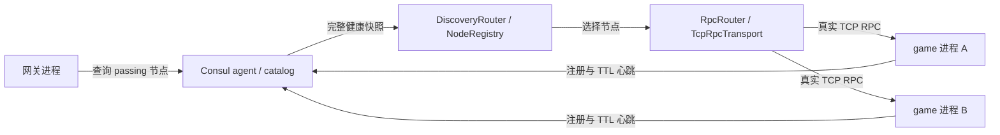

# Consul 发现与跨进程路由

本实现只借鉴组织方式，独立编写，没有复制 ARK 源码。Consul 是可选外部后端，HTTP 使用 libcurl，JSON 使用 nlohmann-json；默认核心构建不增加这两个依赖。

## 数据和调用边界



- `ConsulServiceDiscovery` 实现现有 `ServiceDiscovery` 接口。注册到指定 agent，使用 TTL check 续租；查询 datacenter 内 passing 服务，支持主动注销。
- `discover_services_checked` 区分“成功但没有健康节点”和“后端不可用/响应不合法”。失败不覆盖输出，不发伪造的节点移除事件。旧内存后端通过默认实现保持兼容。
- `DiscoveryRouter::refresh` 在应用拥有者线程轮询，并原子替换一个服务类型的完整路由组。不要把同一类型的静态节点混入这个组。刷新和转发需要由应用串行调度。
- 节点下线、地址变化或 `metadata.incarnation` 变化时，删除连接缓存和该节点的本地会话映射。查询失败采用明确的 fail-closed 策略：撤回整个受管类型的路由并清理相关本地会话；不会无限使用最后一份健康数据。
- 恢复后的下次成功刷新重新建立路由。已经清掉的会话不会自动恢复，客户端需要重新登录/绑定。该选择牺牲注册中心短暂故障时的可用性，以避免继续使用无法验证的会话位置。
- `SessionLocator` 是单个网关进程内的索引，不是分布式会话存储。`forward_session` 只调用已绑定的节点，不自动把有状态命令重放到另一节点。它不迁移玩家状态。
- `RpcRouter` 的通用 `forward` 仍保留原有重试设置，只适用于可以安全重放的请求；业务命令应设置 `set_failover_retries(0)` 或使用固定会话路由。

## 外部依赖与契约

```bash
sudo apt-get install libcurl4-openssl-dev nlohmann-json3-dev
cmake -S . -B build -DCHWELL_USE_CONSUL=ON -DCHWELL_BUILD_EXAMPLES=ON
cmake --build build --target example_discovery_cluster chwell_discovery_tests -j 4
```

外部业务链接 `chwell_consul`，创建后端：

```cpp
chwell::discovery::ConsulConfig config;
config.endpoint = "https://consul-agent.example:8501";
config.ttl_seconds = 10;
config.token = /* 从部署配置读取，不写入日志 */;
auto discovery = chwell::discovery::make_consul_discovery(config);
```

注册、心跳、注销必须访问同一个 agent；健康查询读取 Consul catalog。实例 ID 必须在 datacenter 内唯一，禁止两个活进程复用同一 ID。建议每次进程启动生成唯一实例 ID；如果部署选择复用稳定 ID，必须保证旧进程已经终止，并设置新的 `metadata.incarnation`。Consul agent 的服务注册是覆盖写入，本适配没有提供分布式 CAS、租约所有权令牌或 fenced execution。

心跳间隔应显著短于 TTL。TTL 失效后，节点从 passing 查询中消失；Consul 的定期检查和 catalog 传播意味着下线不是瞬时发生。`deregister_after_seconds` 至少为 60，控制进入 critical 后清理注册记录的时间，不决定 passing 查询的失效时间。

libcurl 使用连接和总请求超时，限制响应为 4 MiB，默认校验 HTTPS 证书，支持 `ca_file`，不跟随重定向。ACL token 放在请求头，错误只记录传输失败或 HTTP 状态，不记录 token 和原始远端响应。后端没有内存 fallback。

监听器不是后台 watch。健康查询成功时按前后快照发布加入、变化和下线，回调在锁外、查询线程上执行；监听器异常不会使有效快照失效。应用应串行执行健康查询与监听器增删，避免把并发请求的完成顺序当成注册中心事件顺序。当前轮询不使用阻塞索引，不能宣称全局严格事件顺序。

`TcpRpcTransport` 用于现有 `cmd/len/body` RPC 协议，检查响应命令和 request ID，连接、发送与接收共用一个调用期限。它支持 Linux/POSIX 数字 IPv4 地址，单连接串行调用，最大业务负载 65531 字节。传输错误关闭连接且不修改调用者原响应。它暂不支持 TLS、域名解析、异步多路复用或 RPC 服务端业务错误编码；超时不等于命令没有执行。

## 运行多进程参考

使用专用本地 Consul dev agent，避免参考测试与其他业务注册混用：

```bash
docker run -d --name chwell-consul -p 127.0.0.1:8500:8500 \
  hashicorp/consul:1.20.6 agent -dev -client=0.0.0.0
python3 integration_tests/test_consul_cluster.py build/example_discovery_cluster \
  --consul-container chwell-consul
docker rm -f chwell-consul
```

测试启动两个独立 game 进程和一个持续运行的网关 probe。它验证不同 key 能通过真实 TCP 到达两个 game，强制杀死其中一个进程后由 TTL 撤回路由，清除失效会话，以新端口/新 incarnation 重启并重建连接，关闭并重启 Consul 后通过心跳重注册恢复，最后验证正常注销和空集群。

probe 是 JSON 行命令工具，连接现有 AppHost、发现和路由接口；它没有客户端登录协议、认证或完整玩家状态。原 `GatewayForwarderComponent` 的静态配置路径仍是旧入口，本次参考工程使用新的 `DiscoveryRouter` 接线。

## 验证

12 项可移植发现/路由测试已在 Windows/MSVC 实际运行。新增 TCP RPC 测试覆盖关联响应、连接复用、截断回复、错误 request ID、超时和连接拒绝。HTTP 适配、TCP 传输及参考程序通过 Linux/musl 交叉编译。

CI 对可选模块运行 Linux 测试、ASan/UBSan、TSan 和 Windows 可移植测试；`consul-cluster` 任务执行真实 Consul 和多进程恢复测试。本机没有 Linux 或 Docker 运行环境，跨进程执行结果以该任务为准。

后续仍需完整客户端/网关参考、分布式会话位置与状态恢复、生产 Consul ACL/多 agent 拓扑测试，以及部署探针和持久化闭环。EntitySchema 按整体计划在跨进程基础之后推进。
